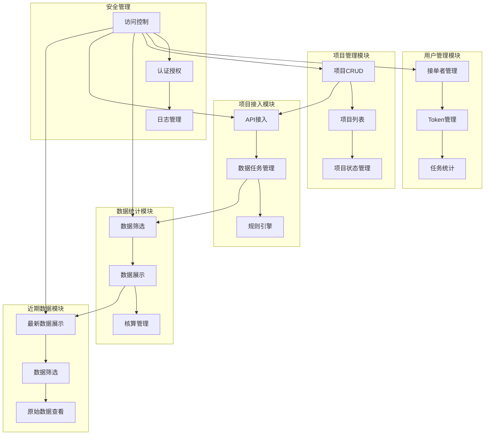

# DS 管理端系统架构图

## 系统模块说明

### 1. 用户管理模块
- 接单者账号管理
- Token 生成与管理
- 任务完成情况统计

### 2. 项目管理模块
- 项目创建与编辑
- 项目列表管理
- 项目状态控制

### 3. 数据统计模块
- 多维度数据筛选
- 数据可视化展示
- 核算状态管理

### 4. 项目接入模块
- 多方式 API 接入
- 数据任务管理
- 规则引擎配置

### 5. 近期数据模块
- 最新数据展示
- 数据筛选功能
- 原始数据查看

### 6. 安全管理
- 访问控制
- 认证授权
- 日志管理 